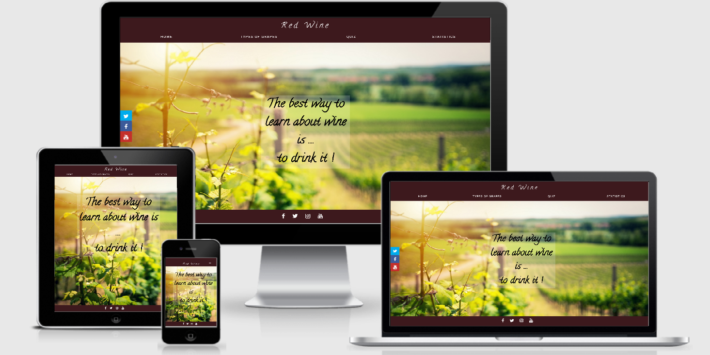

# Aleksandra Kula - Red Wine

Code Institute, User - Interactive frontend development 2019

# Project purpose

Promote knowledge about red wine varieties and grapes amongst adult readers. 

## Demo 

Live demo can be found here: https://olaqla.github.io/RedWine/

## Wireframes
Wireframes are available [here](wireframes)

## UX 
- In my design of user experience I chose to use color theme reminding of red wine that would be consistent with the main topic of the website:

    -  `#3d191d`

    -  `#3b1d2bf7`
    
- Roboto font used throughout the website for paragraphs font-family: 'Roboto', sans-serif;
- Exo font used throughout the website for headings font-family: 'Exo', sans-serif;

 The main purposes of this website is learning how to implement interactive frontend components with javascript and jQuery while extending my styling skills with SCSS, so 
 every section is built around one or many interactive components and all styles in CSS files are generated from SCSS file that I implemented all in responsive fashion.

## Static components: 

### _Main menu_

Main menu on top of the page is responsive. It is a page-wide stripe of horizontally laid out buttons on bigger screens and turns into a hamburger menu on mobile devices and small screens. 
In order to provide smoother user experience buttons are animated when the page is loaded and also provide a visual feedback effect by rolling out underscore when hovered over.  
Each of the menu options opens a subsection covering a specific topic. 

### _Footer_

Footer contains few social media buttons that link to important pages where users can find more up to date information. 

### _Side social media panel_ 

Social media panel is visible only on big screens in middle-left section of the site, to make social media buttons more accessible and compelling than ones in footer. Additional colors and animations made them look crispier and adds a fluid look and feel.

## Interactive components:

### _Age verification overlay_

#### Functionality

Age verification overlay is included in all html files. It's purpose is to perform viewer age verification based on bith data information provided. Component stores provided information long term to avoid asking verification question multiple times. If user date of birth is validated access to site is granted, otherwise overlay with information how many days exactly need to pass before user can access the site. The number of days is recalculated with every visit and user is always presented with either exact number of days left or the viewing ban is lifted when the 18th birthday date is passed and user is automatically granted access to site content without being asked for the birth date information again.

#### Implementation details

Component is implemented as a full screen overlay covering site content, using jQuery and a plugin managing browser cookies. 
When site is opened component checks if it has previously stored cookie with calculated date when access can be grented, if the value is earlier than current date, component doesn't show the overlay, otherwise overlay with calculated number of days till access can be granted is shown. If cookie is not present overlay is shown with dropdowns to pick day, month and year of birth. Dropdowns don't have predefined data but are filled in using javascript. After a date is selected, a cookie is set and the same test as previously is being performed with either showing number of days as a result or granting access to site content. 

### _Photo carousel_

#### Functionality

Photo carousel provides a nice wine-themed gallery of pictures visible in a background. 

#### Implementation details

Carousel is implemented using jQuery only without importing specialized libraries. 
The main container holds a list of pictures loaded in background with css styles. On interval an animation on 'left' property is started making the container viewport move to next image. To provide an impression of infinite scrolling first image is placed in container twice and when carousel slides to it, the animation is turned off and the viewport is immediately scrolled to the first slide. 

### _Grape description text toggle_

#### Functionality

Grape description page consists of multiple cards with grape variety image and a description of a grape itself and it's origin. To make it possible to put a lot of content in a single page and make it easy to find not both types of content are visible at once but user can at any time go to selected card and press a button which part of content he'd like to see and it will be shown with a fluid transition animations. 

#### Implementation details

Text toggle is implemented using jQuery functions to toggle between content types.

### _Grape description search_

#### Functionality

To make it easier for users to find information about particular grape variety I implemented a search component that is capable of filtering just the cards that have title matching what user typed in a search box. If no cards match the search text an information that nothing was matched is displayed.

#### Implementation details

Component is implemented in jQuery by capturing keyUp events from search box. It then captures entered text and filters all the cards that have title fields not starting with exactly the current searchbox value. Component also handles a case when a single result only is displayed to by setting padding (write where) to avoid an effect on footer being pulled to middle of the page on some mobile devices.

### _Grape description map_

#### Functionality

Grape description cards provide a popup map with a pin showing where such variety is produced. 

#### Implementation details

Component consists of a button making the popup to show up and a function responsible to present data on a map. Component wraps google maps javascript API and uses data about pin location placed in "data" property of each card with grape information.  

### _Charts_

#### Functionality

Charts component presents many interesting information across many years about wine production, consumption, import and export ... in form of interactive, easy to read and understand charts. 

#### Implementation details

Charts compont presents data downloaded from ... in form of csv files that were preprocessed before importing to a project. Implementation relies on d3plus which wraps d3js library. Before each chart is drawn data is loaded using either jquery ajax call or csv function from d3js. In some of the charts data is rearranged with javascript code before being passed to d3plus. Chart showing world map with growing area is using topojson information for countries geometry and is presented in an iframe because of immature responsivness implementation in alpha (current) version of d3plus. 

### _Quiz_

#### Functionality

Quiz provides a fun way of learning and validating depth of knowledge of presented information.
At the moment five questions a provided with a summary, a score and a message depending on score at the end. The summary page also has a button to retry the quiz. Each quiz card has four answers which react to mouse hover with crisp animations.

#### Implementation details

Quiz is implemented with javascript and jQuery using good programming practices like avoiding code repetition by reusing parts of code wrapped in function. Quiz data is just an in-memory array that the quiz is iterating over to load question, answers and to check which one is correct. Making quiz data an array rather than embedding those in html, together with code reuse makes it easy to add or change it in the future without requiring code changes but by just modifying data.
Quiz aggregates user results from each card and presents the aggregated value on final screen.

## Technologies

1. HTML 5
   - Document structure definition 
2. CSS3 (generated from SCSS using Live Sass Compiler plugin for Visual Studio Code)
   - Website layout and styling
3. SCSS 
   - Template for generating CSS styles 
4. JavaScrit
   - Interactive elements implementation, data loading and preprocessing
5. jQuery
   - Interactive elements implementation
6. Git 
   - Code Version Control
7. GitHub
   - Repository hosted on GitHub
8.  Github Pages
    - Website hosted on Github Pages
9. Am I Responsive
   - Testing responsiveness of the website
10. Balsamiq Mockups 
    - Creating wireframes
   
## Testing 

### Automated Testing

The following validation services were used to check the validity of the code:

  - W3C Markup Validation Service was used to validate HTML.

  - W3C CSS validation was used to validate CSS.

  - JSHint was used to validate JavaScript.

### Manual Testing

- Website was tested manually using multiple browsers.
- Each html file was tested in multiple screen resolution and in mobile device modes, available in browsers developer tools. 
- All links have been manually tested to ensure that they are pointing to the correct destination. 
- Checked if all alt attributes are add on any img tag on website and if it describes what’s on it. Screen readers for the blind and visually impaired will read out this text and therefore make image accessible.

Browsers used for testing: 

| Browser name        |
| ------------- |
| Google Chrome |
| Microsoft Edge |
| Opera |
| Mozilla Firefox |

Brosers and virtual devices used for responsiveness testing: 

| Device name    |
| ------------- |
| Galaxy S5 |
| Pixel 2 |
| iPhone 5/SE |
| iPad |
| iPad Pro |

## Deployment / Hosting

This site is hosted using GitHub pages, deployed directly from the master branch. The deployed site will update automatically upon new commits to the master branch. In order for the site to deploy correctly on GitHub pages, the landing page must be named index.html.
No deployment process other than configuring repository were necessary.

Deployment process involved:

- Create Git repository on GitHub
- Commit code and code updates to Git repository on GitHub
- Enable hosting setting on GitHub pages
- GitHub pages pointed to host master branch
- Ensure root folder contains README.md and index.html files

To deploy your own version of the website:

- Have git installed
- Visit the repository
- Click 'Clone or download' and copy the code for http
- Open your chosen IDE (Cloud9, VS Code, etc.)
- Open a terminal in your code root directory
- Type 'git clone ' followed by the code taken from github repository
  (git clone https://olaqla.github.io/RedWine/)
- When this completes you have your own version of the website (You can make any changes to it)
- The website can be run by opening one of the HTML files in a web browser
- Saved changes to the website will appear locally after refreshing the page

## Credits

### Content 

- www.wikipedia.org - content about grape varieties.
- www.oiv.int  - data for charts and graphs.

### Media

All the images were found in pixabay.com. The pictures were downloaded from pixabay and scaled down.

** Purpose of this project is educational **
